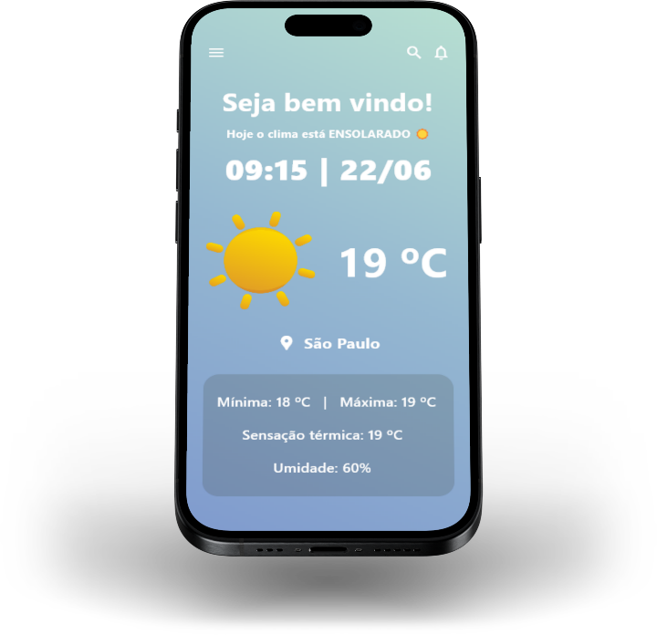

<h1 align="center">Minimalistic Weather App</h1>
<p align="center">Programa minimalista que informa a hora, data e clima de um determinado local</p>

<div align="center">
 
</div>

## Preview:

<div align="center">
 
</div>

## Recursos utilizados:

Projeto desenvolvido utilizando a linguagem ```Python``` na versão 3.11.4 em conjunto com o framework ```Flet``` para a criação da interface gráfica, API do ```OpenWeatherMap``` para coletar os dados do clima e assets do ```Dovora```.
